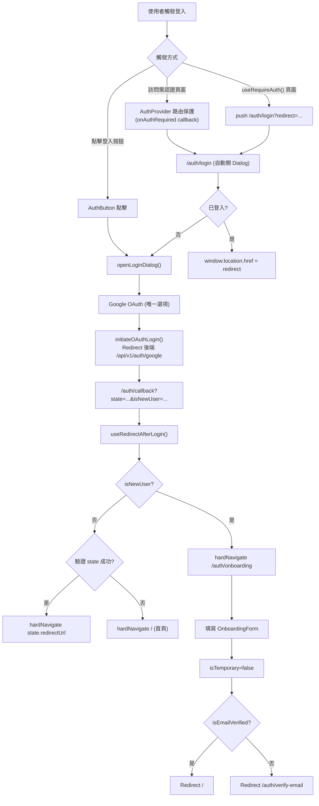
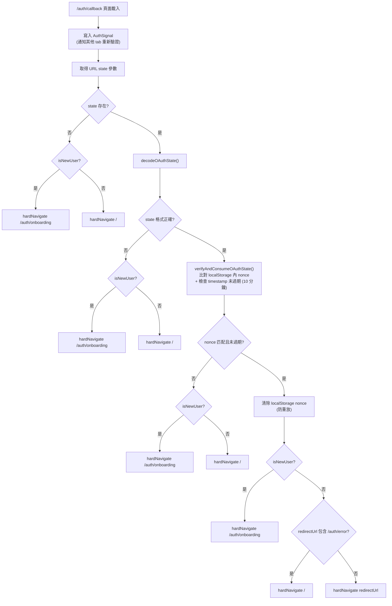
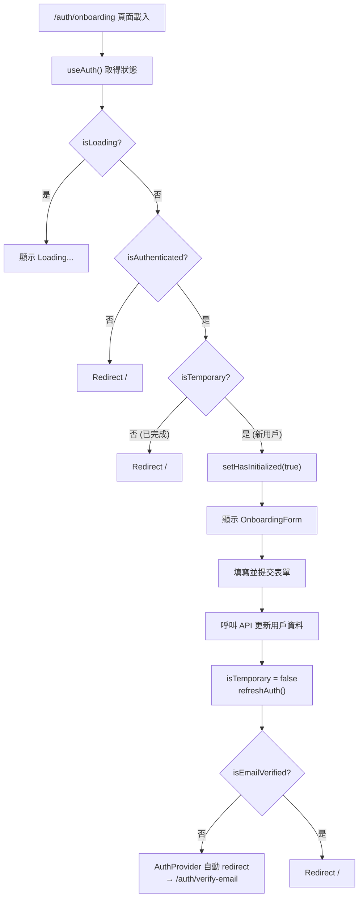
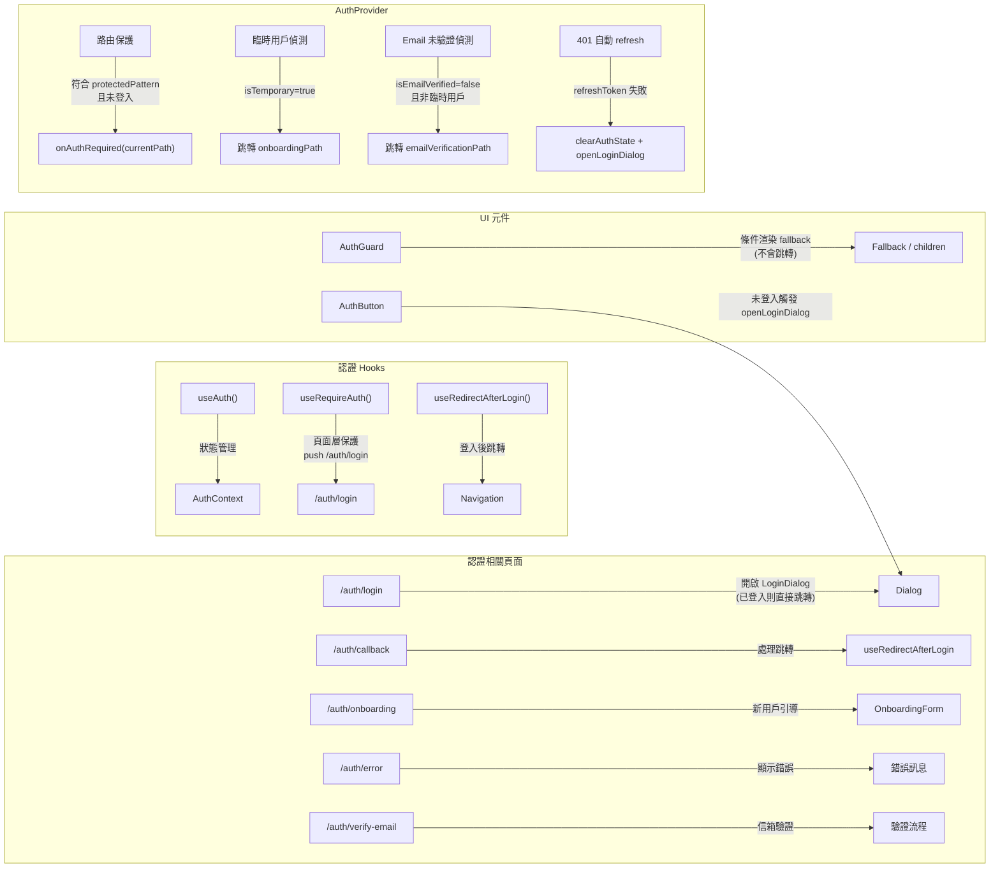
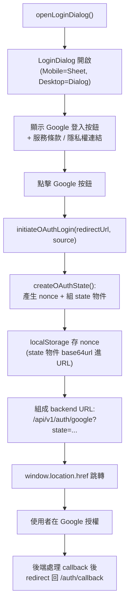
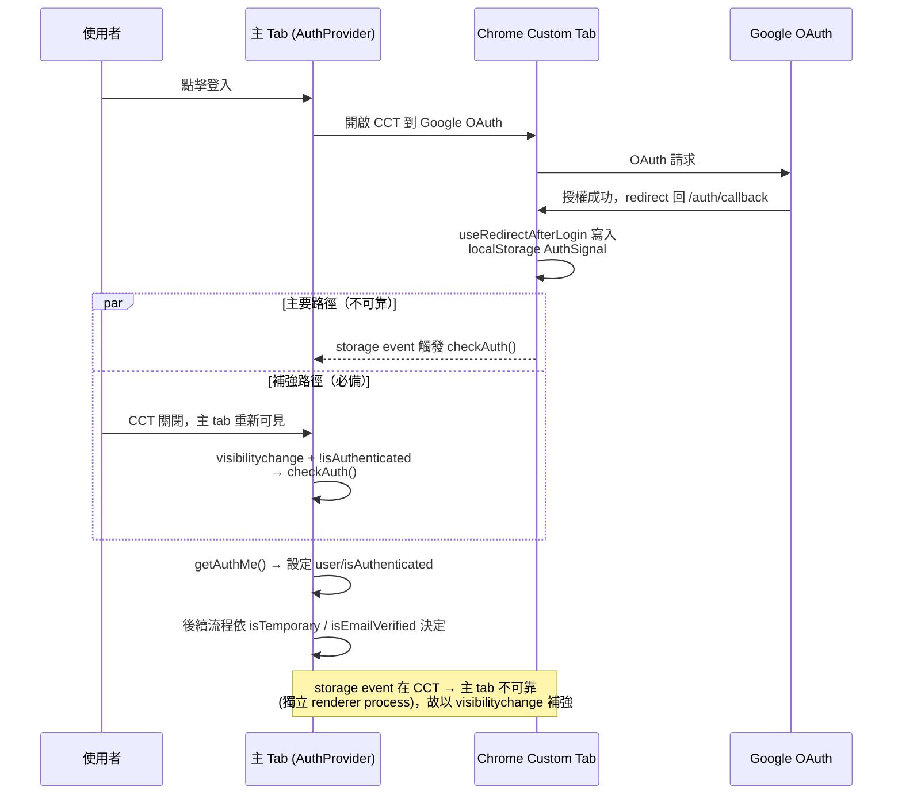
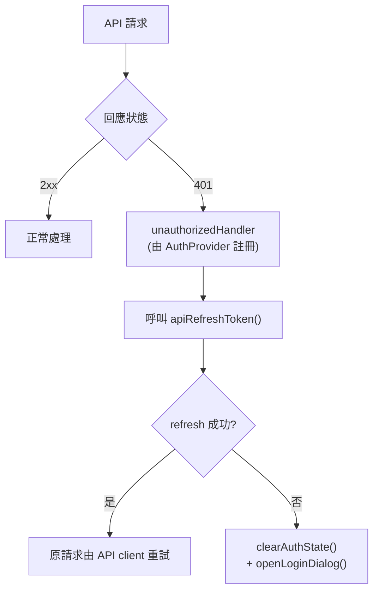
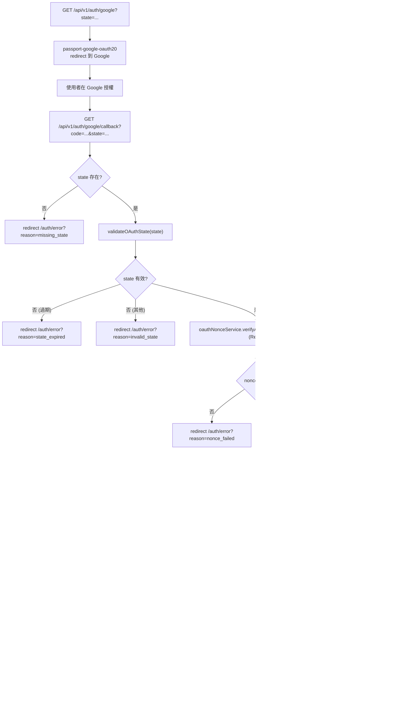

# 登入與認證流程

本文整理 daodao 平台前後端的登入、OAuth、Onboarding、路由保護流程，供工程師快速理解整體運作。

前端程式碼以 `daodao-f2e/apps/product` 為主，使用 `@daodao/auth` package；後端以 `daodao-server` 為主，由 Google OAuth callback 驅動。

---

## 登入流程總覽



---

## OAuth State 驗證流程



> 注意：OAuth nonce 過去使用 sessionStorage，已改用 localStorage。
> sessionStorage 在 iOS Safari ITP / Android Chrome Custom Tab 跨域 redirect 後可能被清空或不共享，
> 會導致 callback 端 state 驗證失敗、redirectUrl 被丟掉、使用者被踢回登入頁。
> 安全性仍由 timestamp（10 分鐘 TTL）+ 一次性消費保障。

---

## Onboarding 與 Email 驗證流程



---

## 各頁面職責



---

## 登入 Dialog 流程



---

## Android Chrome Custom Tab 場景



---

## 401 自動續命流程



---

## 後端 Google OAuth Callback 流程



### 後端關鍵元件

- `src/controllers/auth.controller.ts` — `googleCallback` 主控邏輯
- `src/services/auth/oauth.service.ts` — passport-google-oauth20 設定、`_isNewUser` 判斷
- `src/services/auth/oauth-nonce.service.ts` — nonce 存取（Redis）
- `src/services/auth/oauth-redis-state-store.service.ts` — state 暫存
- `src/services/auth/auth-code.service.ts` — 行動 app 用的一次性 auth code
- `src/utils/oauth-state.ts` — state 物件編解碼、驗證
- `src/utils/cookie-config.ts` — auth cookie 設定（SameSite=none、Secure、可選 domain）

### Cookie 設定

```
name:     auth_token
httpOnly: true
secure:   true
sameSite: none
path:     /
maxAge:   7 days
domain:   process.env.COOKIE_DOMAIN  (例如 .daodao.so)
```

`SameSite=none + Secure` 是跨子域 fetch 帶上 cookie 的必要條件。
若要前後端跨子域共享（`app.daodao.so` ↔ `api.daodao.so`），務必設 `COOKIE_DOMAIN=.daodao.so`。

---

## 相關程式位置

### 前端 (daodao-f2e)

- `apps/product/src/app/[locale]/auth/login/page.tsx`
- `apps/product/src/app/[locale]/auth/callback/page.tsx`
- `apps/product/src/app/[locale]/auth/onboarding/page.tsx`
- `apps/product/src/app/global-provider.tsx`（AuthProvider 路由保護設定）
- `apps/product/src/middleware.ts`（i18n only，無認證檢查）
- `packages/auth/src/hooks/use-auth.ts`
- `packages/auth/src/hooks/use-require-auth.ts`
- `packages/auth/src/hooks/use-redirect-after-login.ts`
- `packages/auth/src/lib/auth-provider.tsx`
- `packages/auth/src/lib/auth-client.ts`
- `packages/auth/src/components/login-dialog.tsx`
- `packages/auth/src/components/auth-button.tsx`
- `packages/auth/src/components/auth-guard.tsx`
- `packages/shared/src/lib/storage.ts`（OAuthNonce / AuthSignal / UserInfo 等 storage key）

### 後端 (daodao-server)

- `src/controllers/auth.controller.ts`
- `src/services/auth/oauth.service.ts`
- `src/services/auth/oauth-nonce.service.ts`
- `src/services/auth/oauth-redis-state-store.service.ts`
- `src/services/auth/auth-code.service.ts`
- `src/services/auth/auth.service.ts`
- `src/routes/auth.routes.ts`
- `src/middleware/auth.ts`
- `src/utils/oauth-state.ts`
- `src/utils/cookie-config.ts`
- `src/utils/redirect-validation.ts`
