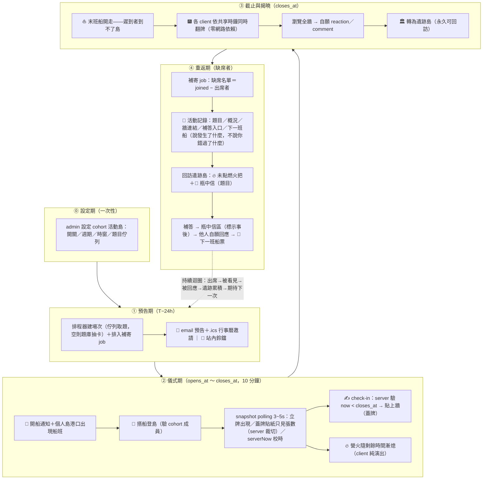

# 活動島即時 check-in — 技術設計

> Change ID: `island-live-checkin`
> 前置閱讀：`proposal.md`（why 與設計決策 D1–D5 不重複於此）

## 0. 全流程總覽



對應第一性推導：①約定感（固定節奏即通知）；②回饋密度濃縮（死法二）；③稀缺性＝儀式感；④羞恥螺旋解藥（死法三）；立牌與火把讓在場/缺席皆可見（死法一）。

## 1. 領域模型：掛在 cohort 上

5~10 人小團**直接使用既有 `cohorts`**（成員 = `cohort_enrollments` where status=joined），不自建成員系統。

- 缺席名單 = joined 成員 − 該場出席者，現成可推導。
- 補寄 job 可比照 `cohort-weekly-digest.service.ts`（BullMQ + email 的現成前例）。
- 排程週期掛在 cohort 設定（MVP 用固定值，不做自訂 UI）。

## 2. 場次狀態機（全部由時間推導，無狀態欄位）

```
              now < opens_at        opens_at ≤ now < closes_at      now ≥ closes_at
              ─────────────         ──────────────────────────      ────────────────
  狀態         scheduled             open（登島、貼牆、蓋牌）          revealed（遺跡島）
  可 check-in     ✗                       ✓（正式）                    ✗（僅補答）
  牆面可見性      —                   只見張數不見內容                  全部翻開
```

**沒有 `status` 欄位**——狀態是 `(opens_at, closes_at, now)` 的純函數。這消滅了排程翻狀態的 job、也消滅了狀態與時間不一致的 bug 類型。翻牌時刻由各 client 依共享時鐘自行觸發（D2）。

## 3. 資料模型（daodao-storage）

```sql
-- island_events：場次
id            SERIAL PK
cohort_id     INT NOT NULL REFERENCES cohorts(id)
question      TEXT NOT NULL              -- MVP 單題開放題
opens_at      TIMESTAMPTZ NOT NULL
closes_at     TIMESTAMPTZ NOT NULL       -- CHECK (closes_at > opens_at)
created_by    INT REFERENCES users(id)   -- NULL = 系統排程產生
created_at    TIMESTAMPTZ NOT NULL DEFAULT now()

-- island_event_checkins：貼紙（正式與補答同表）
id            SERIAL PK
event_id      INT NOT NULL REFERENCES island_events(id)
user_id       INT NOT NULL REFERENCES users(id)
content       TEXT NOT NULL
created_at    TIMESTAMPTZ NOT NULL DEFAULT now()
UNIQUE (event_id, user_id)               -- 一人一場一張（MVP）
```

**補答不設欄位**：`created_at > closes_at` 即為補答（瓶中信區）。與狀態機同一原則——能由時間推導的都不落欄位。

- 缺席補寄的寄送記錄沿用既有 email log 機制（比照 weekly digest），不新增表。
- reaction/comment 沿用既有多型機制對 `island_event_checkins` 掛target type（依既有 `reaction.validators.ts` 的 pattern 擴充允許值——此為 enum/CHECK 類變更，需照 system-map 同步 server TS 常量與 ai-backend Py 常量）。

## 4. API（daodao-server）

| Method | Path | 說明 |
|---|---|---|
| GET | `/api/v1/cohorts/:id/island-events` | 場次列表（含下一班船） |
| POST | `/api/v1/cohorts/:id/island-events` | 建立場次（cohort 幹部；MVP 可先只靠排程） |
| GET | `/api/v1/island-events/:id/snapshot` | **核心**：完整現況（見下） |
| POST | `/api/v1/island-events/:id/checkins` | 寫入；server 驗證身分為 cohort 成員 |

### Snapshot response（polling 資料源＝未來斷線補償，D1）

```jsonc
{
  "event": { "id", "question", "opensAt", "closesAt" },
  "serverNow": "…",            // client 校正時鐘偏移用（risk: 時鐘偏差）
  "participants": [            // 已出席者（立牌渲染用）
    { "userId", "name", "photoURL", "checkedInAt" }
  ],
  "wall": [                    // now < closes_at 時 content 一律為 null（蓋牌）
    { "checkinId", "userId", "content", "isLate" }
  ],
  "absentees": [ { "userId", "name" } ]   // 火把渲染用；closes_at 後才回傳
}
```

- **蓋牌在 server 端裁切**：截止前 snapshot 不出 content，client 想偷看也沒有資料。
- 寫入不變式：`now < closes_at` → 正式；`closes_at ≤ now` 且場次屬已結束→ 允許但即為補答；超前 `opens_at` → 拒絕。
- Polling 間隔：open 期間 3–5s，遺跡島靜態載入即可。

## 5. f2e

### island-engine（保持零 API 依賴，React 殼餵資料）

- `IIslandData` 新增活動島 variant（或新 entry：`IEventIslandData`）——無主島：無 profile 島主、seed = `event-${id}`、無個人 practices 植栽。
- 新增 entities：營火（倒數演出，燃燒程度 = 剩餘時間函數）、便利貼牆（蓋牌/翻開兩態）、立牌（billboard 起步，效能 risk 對策）、火把、瓶中信。
- 事件擴充 `IIslandObjectClickPayload`：`{ kind: "wall-note" }`、`{ kind: "bottle" }` 等。
- 翻牌演出由殼層依 `closesAt - (serverNow - localNow)` 觸發，engine 只提供 `reveal()` 方法。

### apps/product

- 港口船班入口（cohort 頁 + 個人島 harbor 既有點擊點）。
- check-in 表單（沿用 `use-form-draft` 草稿機制）、倒數 UI、揭曉後牆面瀏覽。
- polling hook 比照 `packages/api` 既有 service + hooks pattern；`snapshot` types 等 `sync-openapi` 生成。

## 6. 場次發起與設定

**現實約束**：cohort 的建立與設定今天全在 admin 側（`audit_logs` 記 `admin_id`），成員端沒有幹部管理 UI。因此 MVP 的發起設定掛 admin 側，每場全自動，不依賴任何成員手動操作（符合 D4：固定節奏勝過隨興發起）。

### 設定（cohort 屬性，admin 配置）

```
island_event_enabled    BOOLEAN（開關）
island_event_schedule   週幾 + 時間（例：週一 21:00）
island_event_duration   時窗長度，預設 10 分鐘
題目佇列                 admin 預排清單依序消耗；用完 fallback 官方題庫抽卡
```

儲存形式（cohorts 加欄位 vs 獨立設定表）留給 migration 實作時依既有 pattern 決定。

### 每場自動生命週期

```
T−24h   排程器建立場次（題目自佇列取出）→ 船班預告通知
T−0     opens_at → 開船通知 → 10 分鐘儀式
T+10m   closes_at → client 各自揭曉（D2）→ 補寄 job → 準備下一場
```

### 發起模式演進

| 模式 | 狀態 | 備註 |
|---|---|---|
| admin 排程（全自動） | **MVP** | 貼既有 admin 側 cohort 管理，成本最低 |
| 幹部手動加開 | 第二批 | 依賴尚不存在的成員面向管理 UI |
| 成員輪流出題 | 第二批（優先候選） | 持續槓桿：出題人必到場、所有權輪值；需出題通知流程 + 未出題 fallback |

## 7. 報名與成員來源

**報名單位是「團」不是「場」**：持續迴圈的機制（缺席可見、火把、補寄、被期待）全部依賴固定 roster——散客制讓「缺席」失去定義。加入 cohort = 報名整季儀式，不做單場 RSVP。

- **報名流程全沿用既有 cohort join**：邀請連結 `/cohorts/join/:joinToken` → 同意畫面 → 加入（額滿 `FOR UPDATE` 檢查、`join_deadline`、409 已滿）。零新流程。
- **同意畫面露出儀式約定**（本 change 唯一新增）：`cohortJoinInfo` response 附活動島設定（週期、時窗），同意畫面顯示「本團每週一 21:00 有 10 分鐘 check-in 儀式」——約定感在報名那一刻建立，不是加入後才培養。
- **怎麼知道**：MVP 靠邀請連結外發（admin/幹部經 email/社群）＋官網/社群行銷。產品內發現（遺跡島公開櫥窗、群島導航露出活動島）列第二批——櫥窗撞隱私取捨（牆上是團內真心話），MVP 遺跡島**團內可見**。

## 8. 參與者通知

**現況管道**：站內鈴鐺（`notification_events` + preference/unsubscribe 齊備）、email（history/trigger/weekly digest 前例）；**Web Push 不存在**（PWA 僅 SW 註冊，無 pushManager/subscription）。

**設計原則**：固定節奏本身就是通知——BeReal 需要 push 因為時刻隨機；活動島週期固定、可預期，對即時推播的天然依賴低。要建立的是約定感，不是打斷力。

| 時刻 | 訊息 | 管道 |
|---|---|---|
| T−24h | 船班預告（題目預告可選） | email **附 `.ics` 行事曆邀請**（把當下提醒外包給 OS，零基礎建設）＋ 站內鈴鐺 |
| T−0 | 開船 | 站內鈴鐺 ＋ 3D 世界內：個人島港口出現船班（harbor 既有點擊點） |
| 場中 | — | 已登島者 polling 同步，無需通知 |
| T+10m | 缺席補寄 | email ＋ 站內鈴鐺（見 §9） |

- 通知偏好與退訂沿用既有 `notification_preferences` 機制，新增 island-event 類 type。
- Web Push（VAPID、subscription 表、iOS 需加入主畫面）列第二批——待數據顯示「預告有讀、當下仍缺席」比例高再投資。

## 9. 缺席補寄 job

- `closes_at` 到點：BullMQ delayed job（排程器建場次時一併排入；場次刪除時撤銷）。
- 內容（全事實層，proposal 措辭紅線）：題目、參與概況、揭曉牆連結、補答入口、下一班船時間。
- 對象：joined 成員 − 出席者；走既有 email/通知管道，比照 weekly digest 的模板結構。

## 10. Edge cases

| 情境 | 處理 |
|---|---|
| client 時鐘偏差大 | 以 `serverNow` 校正偏移；寫入永遠 server 裁決，演出誤差無實害 |
| 貼完最後一秒才送達 | server 以收到時間裁決；差幾秒被判補答屬可接受行為（訊息文案要溫和） |
| 場次無人出席 | 補寄照發（內容改為「這場沒有人趕上船」）；遺跡島仍生成，空牆本身是資訊 |
| 同 cohort 場次重疊 | 建立時 server 驗證不重疊（MVP 排程制天然不重疊） |
| 手機低階裝置 | 立牌 billboard、既有 quality tier 降級；活動島無個人植栽負擔，物件數可控 |
